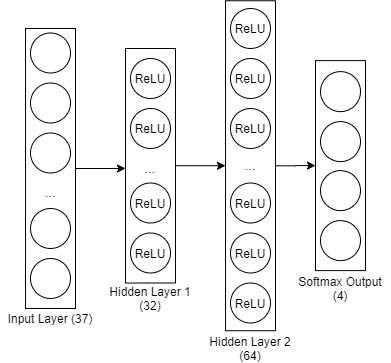
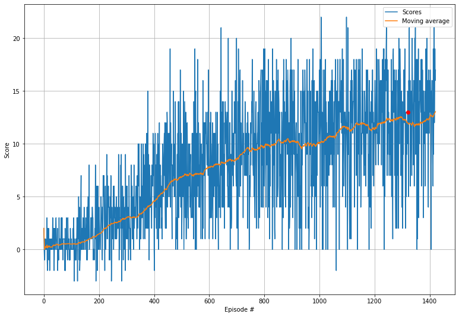

# Report

### Learning algorithm

The final version of the Agent uses Double Deep Q Network approach and Replay Buffer.
Double DQN adresses maximization bias by using two networks: one for the selection of the next action, and antoher for the evaluation of that action.
Replay buffer is used to decorrelate training examples to update the neural net, storing past experiences and randomly sampling a batch of samples for each training step. Target network is updated each 4 steps using batch with size of 64 samples. The discount factor is 0.99, so later rewards are valued less the the closest ones.

The foolowing network architecture has been used for Q Network:

Each hidden layer is followed by ReLU activations, and softmax is used to get final probabilities of actions.

### Rewards

The environment has been solved in 1322 eisodes using only CPU.

Here's the scores plot (along with the moving average curve):

### Future work

As futher improvements of the Agent dueling DQN and prioritized experience replay (PER) might be used.
Since Q function can be represented as a sum of the Value and the advantage function, we can introduce two networks to learn each part of that sum and aggregate their inputs later.
The central idea around PER is to sample more important experiences with higher probabilities.